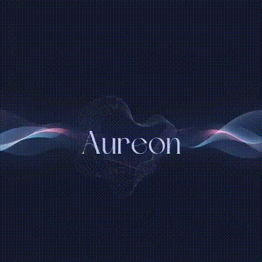

 </img>

<h1> AUREON – Ecossistema Inteligente de Conexão Acadêmica </h1> 

### Sobre o Aureon
O projeto Aureon é um trabalho desenvolvido para apresentação do **Projeto Interdisciplinar*** para o professor **Edilson** da faculdade Ceuma de **Engenharia da Computação** no turno da manhã
  
Participantes desse projeto: 
- Iasmin
- Paulo Thaylam
- Thalisson
- Alef Oliveir
 

## Introdução

Com o avanço da tecnologia e o crescimento do ensino superior, observa-se que muitos estudantes enfrentam dificuldades acadêmicas, falta de orientação profissional e limitações financeiras para acesso a cursos complementares. Paralelamente, diversos alunos possuem habilidades e conhecimentos que poderiam ser compartilhados.
 
Diante desse cenário, foi desenvolvido o Aureon, uma plataforma web inteligente que promove a troca colaborativa de habilidades entre universitários, integrando sistema de recomendação acadêmica, segurança avançada e experiência humanizada.

O projeto foi construído utilizando tecnologias amplamente utilizadas no desenvolvimento web, atendendo aos requisitos técnicos estabelecidos.
 

## Objetivo Geral

Desenvolver uma plataforma web segura e inteligente que conecte universitários para troca de habilidades e ofereça orientação acadêmica personalizada, promovendo economia colaborativa e redução de barreiras educacionais.

---

<h3 align="center">  <a href="https://paulothaylam.github.io/Aureon/">Clique para acessar o <strong> prototipo do Aureon </strong></a> </h3>
